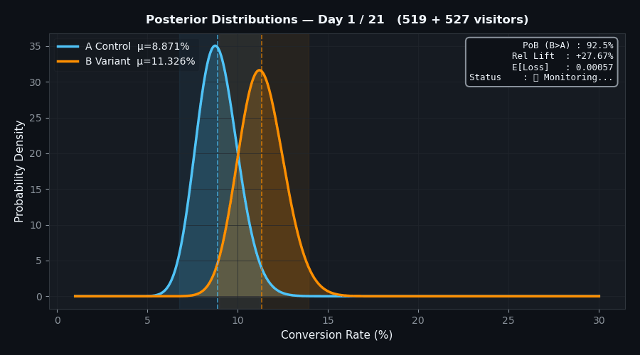
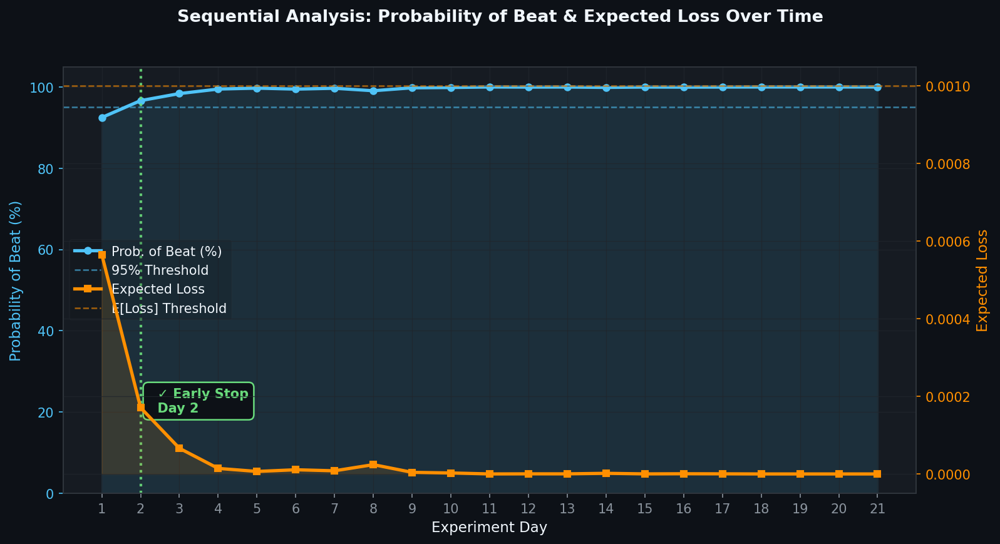
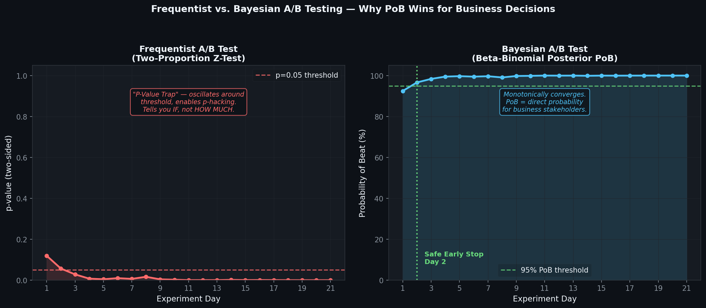

# High-Confidence Bayesian A/B Testing & Sequential Analysis Engine

A production-grade Bayesian A/B Testing framework that goes beyond p-values to deliver **Probability of Being Better (PoB)**, **Expected Loss**, and **credible intervals** — enabling statistically sound early stopping decisions.

---

## Why Bayesian?

| Frequentist (p-value)           | Bayesian (PoB)                            |
|---------------------------------|-------------------------------------------|
| "Is there a difference?" (yes/no) | "How likely is B better, and by how much?" |
| Requires fixed sample size      | Supports sequential monitoring             |
| Prone to p-hacking / early stop | Early stopping with integrity              |
| p=0.04 ≠ "95% chance B is better" | PoB=0.95 literally means that           |
| No risk quantification          | Expected Loss quantifies deployment risk  |

---

## Project Structure

```
src/
  generate_data.py    — Synthetic 21-day experiment generator
  bayesian_engine.py  — Beta-Binomial engine (PoB, Loss, HDI)
  analyzer.py         — Sequential processor + all visualizations
  main.py             — Interactive CLI
outputs/
  experiment_data.csv
  posterior_evolution.gif
  risk_vs_time.png
  frequentist_vs_bayesian.png
  summary.json
```

## Visualizations

### 1. Posterior Evolution (Sequential Updates)

*Watch how the conversion rate estimates converge over 21 days as more data is gathered.*

### 2. Risk vs. Time (Expected Loss)

*Visualizing the decline of Expected Loss and the rise of Probability of Beat.*

### 3. Frequentist vs. Bayesian Comparison

*Why Bayesian methods provide more intuitive results for business stakeholders compared to volatile p-values.*

---

## Quickstart

```bash
# 1. Install dependencies
pip install -r requirements.txt

# 2. Run the full pipeline (generate → analyze → report)
python src/main.py --run-full

# 3. Or run steps individually:
python src/generate_data.py      # Creates outputs/experiment_data.csv
python src/analyzer.py           # Creates all charts + summary.json

# 4. CLI: single query for real-time PoB
python src/main.py --ca 52 --va 480 --cb 63 --vb 495

# 5. Interactive mode (prompts for input):
python src/main.py
```

---

## Mathematical Framework

### Prior
```
Beta(α₀=10, β₀=90)  ←  encodes ~10% historical baseline
```
Weakly informative: 100 pseudo-observations, overridden quickly by real data.

### Bayesian Update (closed-form — no MCMC needed)
```
α_posterior = α_prior + Σ conversions
β_posterior = β_prior + Σ (visitors − conversions)
```

### Key Metrics (20,000 Monte Carlo samples per day)

| Metric | Definition |
|--------|-----------|
| **PoB** | `P(θ_B > θ_A)` — fraction of samples where B beats A |
| **Relative Lift** | `(μ_B − μ_A) / μ_A × 100%` |
| **Expected Loss** | `E[max(θ_A − θ_B, 0)]` — average regret of deploying B |
| **95% HDI** | `Beta.ppf([0.025, 0.975], α, β)` — credible interval |

### Early Stopping Rule
```python
if expected_loss < 0.001 and pob > 0.95:
    → "EXPERIMENT COMPLETE — Safe to deploy Variant B"
```

---

## Output Artifacts

| File | Description |
|------|-------------|
| `experiment_data.csv` | 21-day raw data: visitors + conversions per group |
| `posterior_evolution.gif` | Animated Beta posteriors narrowing over time |
| `risk_vs_time.png` | Dual-axis: PoB rising, Expected Loss falling |
| `frequentist_vs_bayesian.png` | Side-by-side comparison of both methodologies |
| `summary.json` | Final PoB, HDI, lift, decision recommendation |

---

## Experiment Parameters

- **Group A (Control):** true conversion rate = 10.5%  
- **Group B (Variant):** true conversion rate = 12.0%  
- **Daily traffic:** Poisson(μ=500), clamped to [400, 600] visitors/group  
- **Duration:** 21 days  
- **Prior:** Beta(10, 90) — informative (toggle to Beta(1,1) with `--prior flat`)

---

## CLI Reference

```
python src/main.py [OPTIONS]

Options:
  --ca INT      Conversions in Group A
  --va INT      Visitors in Group A
  --cb INT      Conversions in Group B
  --vb INT      Visitors in Group B
  --prior       informative (default) | flat
  --run-full    Run complete pipeline: generate → analyze → report
```
